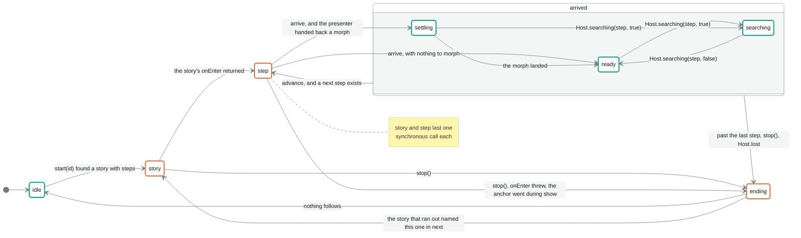
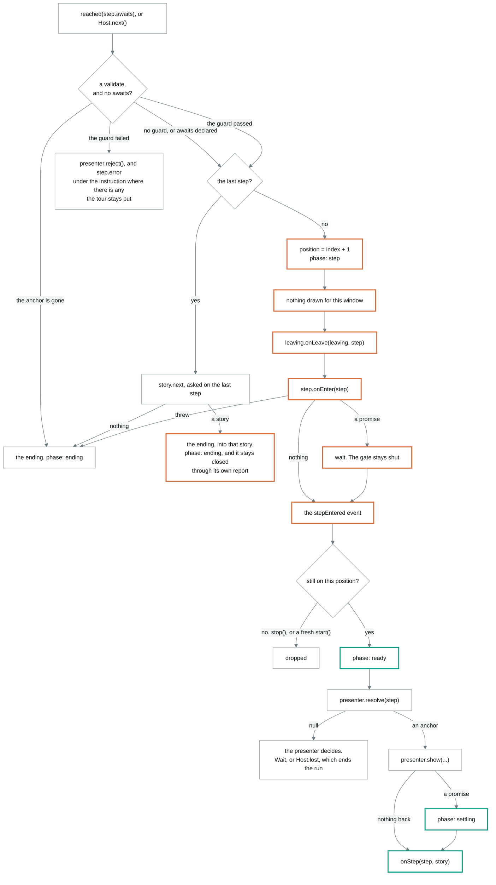

# The phases, drawn

The machine has six phases and one state value with six fields in it. This file
is the picture of them. `plan.ts` holds the phases, the state and what each event
does to them, and `machine.ts` makes the calls that follow.
[`README.md`](README.md) beside this says how the model is searched, and
`machine.qnt` is the same graph written down in a form a search can walk. When
they disagree, the code is the one that is right.

I drew this after the model was already green. Six phase names read off a union
type told me nothing about which of them a call from the application survives,
and that is the question I keep having.

## The two fields

There is no stored `state`. It is read off these every time it is asked.

| | |
| --- | --- |
| `position` | the running story and the index in it, or `undefined` while nothing runs |
| `phase` | one of the six below |

`state` is `idle` when there is no position. Otherwise it is `running` if the
phase is `ready`, and `transitioning` for the other five.

Read that carefully around `ending`. A teardown empties the position before it
calls a single handler, so a handler asking `state` from inside its own
`onLeave` is told `idle`. The phase underneath is still shut, and that is what
refuses a `start()` made from in there. The two answer different questions.

`position` is replaced on every move and on nothing else. That is what makes its
identity the step occurrence the tour is standing on. Every event that can land
late carries the position it was planned at, and `plan.ts` asks `stillAt` before
it acts on one. There are eight of those asks.

## The phase machine



A teal outline means a call from the application is acted on. A clay outline
means the machine is inside a call into the application, and everything but
`stop()` is turned away.

`arrived` is a grouping and there is no such phase in the code. It holds the
three that mean the step is on screen and the tour is standing on it. `advance`,
`stop()` and `Host.lost` do the same thing from all three, so they are drawn
once instead of nine times.

| Phase | `state` | What is true |
| --- | --- | --- |
| `story` | `transitioning` | a run is starting. The story's own `onEnter` is running or about to be, and no step has been entered |
| `step` | `transitioning` | a step is being entered. The one being left has had its `onLeave`, this one's `onEnter` is running, the anchor has not been looked for, nothing is drawn |
| `settling` | `transitioning` | the step arrived and is drawn. The presenter is still moving it |
| `searching` | `transitioning` | the step arrived, its anchor has since left the page, and the presenter is looking. The tour is still on that step. What is on screen is a curtain. A target that was missing when the step arrived is `settling` instead: that wait is one the machine was handed a promise for |
| | | A step that names no target at all is `ready`. It is drawn and still, and what it waits for is a signal |
| `ready` | `running` | the step is drawn and still. The only phase `state` calls `running` |
| `ending` | `idle` | a run being torn down. `teardown()`, then the step's `onLeave`, then the story's. `position` is already `undefined`, which is why `state` says `idle` here while the gate is still shut |

## The gate

`accepting` in `plan.ts` is one line and it decides everything above.

```ts
core.phase === 'ready' || core.phase === 'settling' || core.phase === 'searching'
```

`idle` is open too. Its phase is `ready` and it has no position.

A step that is drawn and still moving has been through the whole arrival and the
user is looking at it. A call about it means what it says, so `settling` and
`searching` are open.

| Call | Accepted in | What it does |
| --- | --- | --- |
| `start(story)` | open | ends whatever runs, telling it where the tour is going, then enters at index 0. The story the tour is already on starts again. An empty story tears nothing down |
| `reached(name)` | open | advances only the step whose `awaits` is that name. Any other name is free and silent |
| `stop()` | anywhere | the one call the gate does not stand in front of. A step still arriving is thrown away rather than waited for |
| `Host.next()` | open | private, and reachable only through the presenter. A step declaring `awaits` never gets a control |
| `Host.moved()` | open | places the step where it belongs now, without animating. No phase change and no report |
| `Host.searching(step, yes)` | `ready`, `settling` | starts a wait only for the step the tour is on, and only for a target lost after the step was drawn. Ending one asks nothing |
| `Host.lost(step)` | anywhere | ends the run if `step` is still the step the tour is on |
| `Host.close()` | anywhere | means what `stop()` means |

A refused `start()` reports `call-refused`. A matched `reached()` reports `signal-dropped` and is thrown
away. Holding it over would advance a step on something that happened before
that step began.

## Inside one arrival

This is the `step` box above, opened up. The gate is shut for all of it except
the last three boxes.



A handler that hands back nothing costs no turn. The whole path can run inside
the call that started it.

`phase` goes to `ready` before the draw rather than after. A step whose anchor
turns out to be missing can end the run from inside `show`, and the `onStep`
that reports that ending has to find a machine a host may call into. In
`plan.ts` that is the `stepEntered` event committing `opened` and owing a
`draw`, in that order, and there is no way to write it the other way round.

## What lands late

Three things resolve after the turn that started them. Each one can find the
tour standing somewhere else, and each one checks a different thing.

| What | What it compares |
| --- | --- |
| an `onEnter` that called `stop()` | the captured `position` object against the current one |
| a morph | the token in `showing`, because two arrivals at the same position are two occurrences |

A refusal is not on this list. `validate` answers in the turn it is asked, and
`error` is read in the same turn, so there is nothing left over to land later.
The `refused` event still asks where the tour got to, because `validate` is the
application's own code and can call `stop()` from inside itself.

The morph has one more check after that. It may only write `ready` if the phase
is still `settling`. A target that left the page mid morph has written
`searching` over it, and that wait ends when the presenter says it does.

## Where to watch each of these happen

`examples/sandbox` is the only place a person can see these run. Its footer logs
every call and every hook in the order a host receives them, so a phase this
file names has a case to open.

The table is this way round on purpose. Fifteen cases each describing which
phases they touch would be fifteen paragraphs that nothing checks, and four of
the cases are about the scrim rather than the machine and would have nothing to
say. One table pointed the other way is one place, and it shows the holes.

| Phase or transition | Where to watch it | What to do |
| --- | --- | --- |
| `story` | `story-setup` | start it. The story's own `onEnter` runs before any step exists, inside the `start()` call |
| `step` | `step-setup` | press Next. Each `onEnter` runs inside the call that moved the tour |
| `settling` | any case, `stepping` is plainest | the morph is 320ms, and the log says `transitioning` for that long on every move |
| `searching` | `target-disappears` | press **Dismiss for a second**. The target comes back inside the window and nothing is reported |
| a step that waits | `step-setup`, `story-setup` | press Next onto the step with no `target`. The page goes under, and the signal the step names is what ends it |
| `ending`, and then `idle` | any case | press `stop()` in the footer |
| `ending`, and then `story` | `branching` | press either path button. The story that ran out names the one that follows it |
| a `start()` turned down for a tour that is running | `two-stories` | press the other `start()` button while a story runs. Nothing moves, and the footer says which tour it left alone |
| a `start()` from the ending report | none | no case needs it now that a story names what follows it. `machine.test.ts` has it |
| a `reached()` the gate turned down | none | the window is one synchronous call wide, so reaching it takes a `reached()` made from inside an `onEnter` on the step that awaits the name. `machine.test.ts` has it |
| a `start()` the gate turned down | none | the same one-call window as the row above. `machine.test.ts` has it |
| `Host.lost` ending a run | `target-disappears` | press **Dismiss**. Two seconds under a curtain, then the tour stops |
| `validate` refusing to advance | `form-validation`, `next-control` | press the control with the field empty. The step stays where it is |
| `error` worked out from the field | `form-validation` | press Next on the password step. The reason counts the characters that were there |
| a story handing the tour on | `branching` | press either path button. `intro` runs out and its `next` answers with the branch the page recorded |
| a chain not followed | `branching` | press the way out on a branch. Only a story that ran to the end is followed, so the summary never opens |
| `Host.next` | `next-control`, `stepping` | the control on the message. A step declaring `awaits` never has one |

### What no case reaches

Worth knowing before trusting the table above.

- A story's `onEnter` that throws, and a step's `onEnter` that throws. Both end
  the run and rethrow. `machine.qnt` has story `c` for the first and step `b2`
  for the second, so the model covers both and the sandbox covers neither.
- `story-not-found` and `story-empty`. Both are `start()` diagnostics and the
  footer only offers ids that exist.
- A morph landing while the phase is `searching`. The model has a trace named
  `morph-under-search` for it. Getting a target to leave the page inside a 320ms
  morph by hand is not something a case can ask a person to do.
- A `start()` made from an ending report. `branching` was the case for it and
  the rejoin is a `next` now, so nothing in the sandbox starts a story from
  inside a report any more. `machine.test.ts` still asks it, twice: once for the
  answer it gives and once for the refusal a chained ending hands back.

## Redrawing this

Nothing generates these diagrams. They are read off `plan.ts` and
`machine.qnt` by hand, which means they can go stale. If you change a phase
transition, change the first diagram in the same commit.

The colours are outlines rather than fills on purpose. A `classDef` that sets
`fill` and `color` together does not always get its `color` through to the
label, and the result is dark text on a dark box. An outline says the same thing
and cannot break that way.
